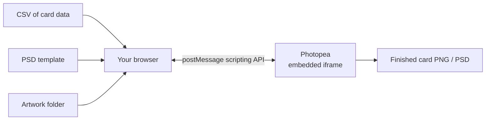

# 🃏 ReleaseTCG Card Generator

Turn a spreadsheet, a PSD template, and a folder of artwork into a finished stack of print-ready card PNGs — right in your browser, no install required.

**▶ [Open the live app](https://hungnguyen922.github.io/AutomaticCardTemplateActualizer/)**

---

## What this is

This app reads a **CSV** of card data, opens your **PSD** template and each piece of **artwork** inside an embedded [Photopea](https://www.photopea.com/) editor, and drives Photopea's scripting API to fill in text, toggle color/stat layers, drop in the art, and export a finished PNG (and optionally a PSD) — one card at a time or the whole set in a batch.

Everything runs client-side. There is no backend, no upload of your files to any server, and no build step — it's hosted for free on GitHub Pages and works straight from this repo's link.

## How it works



- **CSV** — parsed locally with [PapaParse](https://www.papaparse.com/); never leaves your machine.
- **PSD template** — uploaded once into a hidden Photopea document and reused for every card.
- **Artwork folder** — indexed by filename in your browser; matched to each row's `Art` column.
- **Photopea** — an [iframe embed](https://www.photopea.com/api/live) that receives small ExtendScript-style scripts and binary files over `window.postMessage`, and reports back progress, errors, and exported binaries the same way.

No files are sent anywhere except into the Photopea iframe running in your own browser tab.

## Quick start

1. Open the [live app](https://hungnguyen922.github.io/AutomaticCardTemplateActualizer/) and wait for the Photopea panel to say **Ready**.
2. Select your **CSV**, your **PSD template**, and your **artwork folder**.
3. Click **Load cards** — each row becomes a card with an art-match status.
4. Pick an art **scale mode** (see below).
5. Generate:
   - **Generate** on one card to preview + iterate on it.
   - **Export PSD + PNG** to download that card once you're happy.
   - The bulk **Generate All** button runs every card and downloads results automatically, with a progress bar and per-card pass/fail status.

## CSV format

| Column | Used for |
|---|---|
| `Name` | Card title (auto-centered text layer) |
| `Power`, `Bulk` | Toggles the matching numbered layer inside the `Stats` group |
| `Color1`–`Color4` | Up to 4 color pips — see [color codes](#color-codes) below |
| `Trait` | Header line above the effect text |
| `Effect1`, `Effect2` | Header lines |
| `Clarify1`–`Clarify3` | Paragraph-style clarification text under each header |
| `CardNumber` | Bottom-line card number, and used to name exported files |
| `SetName` | Bottom-line set name |
| `Artist` | Bottom-line artist credit |
| `Art` | Filename (no path needed) to match against your artwork folder |
| `Flavor`, `Inspiration` | Parsed but not yet placed — the current template has no layers for these |

Blank cells are fine — the matching layer is just hidden rather than left empty.

### Color codes

`Color1`–`Color4` accept: `RED`, `ORANGE`, `YELLOW`, `GREEN`, `CYAN`, `BLUE`, `VIOLET`, `MAGENTA`, `PINK` (case-insensitive). Each maps to a single-letter layer (`R O Y G C B V M P`) that must exist inside the matching `Color1`/`Color2`/`Color3`/`Color4` subgroup of the template's `Colors` group.

## Artwork matching

Select an artwork **folder** once — the app indexes every file in it by filename (extension-insensitive). The `Art` column only needs the filename:

```
Art
sandy-dues.png
```

`sandy-dues.PNG`, `sandy-dues.jpg`, etc. all match `sandy-dues` in the CSV.

## Art scale modes

| Mode | Behavior |
|---|---|
| `cover` *(default)* | Fills the card, cropping overflow — no letterboxing |
| `contain` | Fits entirely inside the card, may letterbox |
| `stretch` | Fills the card exactly, ignoring aspect ratio |
| `none` | Pastes at 100% scale, centered |

## Template requirements

Your PSD needs these named layers/groups for the generator to find them:

- `ArtLayer` — placeholder the generated art is inserted before, then hidden
- `CardName` — a **text** layer for the card title
- `BottomLine` (or `BottomLin`) group containing `CardNumberLine`, `SetName`, `ArtistLine` text layers
- `Effects` group containing `TraitLine`, `Effect1Line`, `Effect2Line` (headers) and `Clarify1`, `Clarify2`, `Clarify3` (paragraph text)
- `Colors` (or `Color`) group containing `Color1`–`Color4` subgroups, each with `R O Y G C B V M P` layers
- `Stats` group containing `Power` and `Bulk` subgroups, each with numbered layers (`0`, `1`, `2`, …) matching possible CSV values

Use the **Inspect template** button in the app to print the full layer tree of your loaded PSD to the browser console (F12) — handy for checking your naming matches before generating.

## Running it locally instead

The app is plain static HTML/JS/CSS in [`src/`](./src) — any static server works. A minimal one is included:

```bash
python server.py
# then open http://127.0.0.1:8765
```

## Deployment

The site auto-deploys to GitHub Pages on every push to `main` via [`.github/workflows/deploy.yml`](./.github/workflows/deploy.yml), which publishes the `src/` folder directly — no build step, no server to maintain.

## Under the hood: the Photopea handshake

A few things make the generation pipeline reliable across both fast (localhost) and slower (real-world hosted) connections:

- **Serialized command queue** — every script/file sent to Photopea is chained through a single promise queue, so commands can never race each other from the app's side.
- **Two-phase artwork placement** — the artwork is `copy()`/`paste()`d in one round trip, then a stabilization poll (`waitForPastedArtReady`) confirms Photopea has actually finished realizing the pasted layer's bounds *before* a second round trip scales and positions it. Doing both in a single script worked fine on localhost but could race Photopea's own rendering pipeline over real network latency — splitting it into two confirmed round trips closes that gap.
- **Errors surfaced, not swallowed** — every script is wrapped so Photopea-side exceptions are caught and reported back via `app.echoToOE("ERROR:...")` instead of becoming a silent failure or an unhandled iframe promise rejection.

## Known limitations

- `Flavor` and `Inspiration` columns are parsed but not yet rendered — add matching layers to the template and wire them up in `buildPasteScript` if you want them.
- One card can be "live" in Photopea for editing at a time; generating a different card while one is open will prompt before discarding unsaved changes.

## Credits

- [Photopea](https://www.photopea.com/) — in-browser PSD engine and scripting API
- [PapaParse](https://www.papaparse.com/) — CSV parsing
